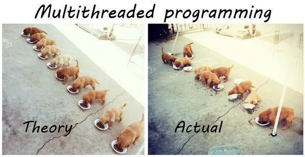
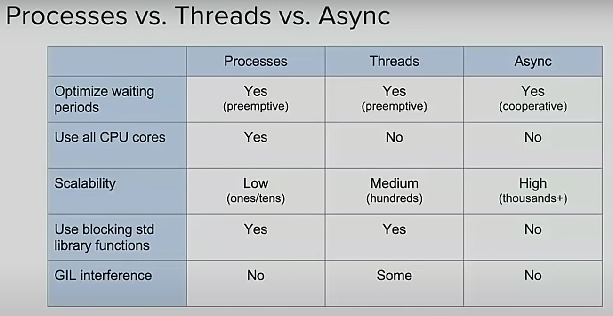
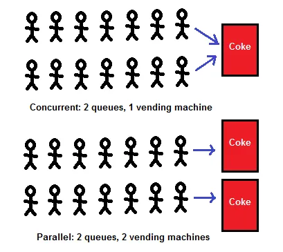

*******************************************************************************
                    CONCURRENCY AND PARALLELISM
*******************************************************************************




*******************************************************************************
                                DEFINITIONS
*******************************************************************************

|  Program   |  Process[es]   |  Thread[s]                    |
|:----------:|:--------------:|:-----------------------------:|
|      1     |     1...n      |   1...n*m                     |
| e.g. Word  | e.g. n-windows | e.g. each window do m-things  |

---

- **Program**:

    Passive collection of instructions e.g. stored in a file on disk\
    The same program can have several processes running.

- **Process**:

    Instance of a program, executed by one or ma-ny threads.\
    Process (or task) is "something that takes up time", as opposed to\
    "memory", which is "something that takes up space"

- **Thread (of execution)**:

    A sequence of instructions executed within the context of a process. 

---

Multitasking, multiprogramming, multiprocessing, multithreading...

    Methods to share resources.
    
    Note: each CPU (core) executes a single thread at a time.

---

## **CONCURRENCY**

Is about **DEALING** with lots of things at once\
When at least two threads are **MAKING PROGRESS**.

    A more generalized form of parallelism that can include
    time-slicing as a form of virtual parallelism.

## **PARALLELISM**

Is about **DOING**  lots of things at once.\
When at least two threads are **EXECUTING SIMULTANEOUSLY**.

## **Asynchrony**

Impression of concurrent or parallel tasking.\
Don't block our application awaiting for some code response.\
e.g. don't block our UI waiting for the data.

    The async call takes a call-back reference and returns execution back to
    your code as soon as the request has been placed with the remote system.
    e.g. AJAX, WebSockets, Promises, Observables, async/await, etc.



---
---

## Concurrency

    When 2+ tasks can start, run, and complete in overlapping time periods.

    e.g. multitasking on a single-core machine use time slicing, this is,
         CPU switches between threads (virtual multitasking)

        +--------+-----------+--------+-----------+--------+
        |  core  |  Task 1   | Task 2 |  Task 1   | Task 2 |
        +--------+-----------+--------+-----------+--------+

## Parallelism

    When two or more tasks literally run at the same time, truly multitasking

    e.g. a multicore processor, a cluster of CPUs, several EC2 instances (AWS)

        +--------+--------+--------------+
        | core 1 |      Task 1           |
        +--------+--------+--------------+
        | core 2 |      Task 2     |
        +--------+--------+--------+



---
---

### **Process:**

    An environment created which is set up to run a program.

### **Thread**
    
    A basic unit of CPU utilization, comprising a thread ID, a program counter, a register set, and a stack.
    
    A set of instructions executed within the context of a process.

---

* Intensive CPU tasks (CPU bound)
* Intensive IO tasks (IO bound)

---
*******************************************************************************
                        CPython implementation detail
*******************************************************************************

    In CPython, due to the GIL, only one thread can execute Python code at once
    (even though certain performance-oriented libraries might overcome this
    limitation).
    
    If you want your application to make better use of the
    computational resources of multi-core machines, you are advised to use
    multiprocessing or concurrent.futures.ProcessPoolExecutor.
    
    However, threading is still an appropriate model if you want to run
        multiple I/O-bound tasks simultaneously.

    Use ThreadPoolExecutor  for intensive IO tasks. (aka. concurrency)
    Use ProcessPoolExecutor for Intensive CPU tasks. (aka. parallelism)

---
---
---


https://forms.office.com/Pages/ResponsePage.aspx?id=eME_CzC3i06YQ-gSWSN7d7VB9bTbMJ9Mh3W7X1zAylhUNzFEWkxZV1pFVEQ5UkVTQkFNQUdDUk9EVCQlQCN0PWcu


*******************************************************************************
                            Threads - Basic
*******************************************************************************
https://www.pythontutorial.net/python-concurrency/python-threading/

```python
new_thread = Thread(target=func_name,args=params_tuple)
new_thread.start()
new_thread.join()   # Wait until finish
```


*******************************************************************************
                            Thread Pool Executor
*******************************************************************************

https://www.pythontutorial.net/python-concurrency/python-threadpoolexecutor/

https://docs.python.org/3.8/library/concurrent.futures.html#concurrent.futures.ThreadPoolExecutor

```python
from concurrent.futures import ThreadPoolExecutor, as_completed
import urllib.request

URLS = ['http://www.foxnews.com/',
        'http://www.cnn.com/',
        'http://europe.wsj.com/',
        'http://www.bbc.co.uk/',
        'http://some-made-up-domain.com/']

def load_url(url, timeout):
    with urllib.request.urlopen(url, timeout=timeout) as conn:
        return conn.read()

# We can use a with statement to ensure threads are cleaned up promptly
with ThreadPoolExecutor(max_workers=5) as executor:
    result = {}
    # Start the load operations and mark each future with its URL
    future_to_url = {executor.submit(load_url, url, 60): url for url in URLS}
    for future in as_completed(future_to_url):
        url = future_to_url[future]
        try:
            result[url] = future.result()
        except Exception as exc:
            print(f"{url} generated an exception: {exc}")
        else:
            print(f"{url} page is {len(result[url])} bytes")
```


*******************************************************************************
                            Process Pool Executor
*******************************************************************************

```python
from concurrent.futures import ProcessPoolExecutor,
import urllib.request

URLS = ['http://www.foxnews.com/',
        'http://www.cnn.com/',
        'http://europe.wsj.com/',
        'http://www.bbc.co.uk/',
        'http://some-made-up-domain.com/']

def load_url(url, timeout):
    with urllib.request.urlopen(url, timeout=timeout) as conn:
        return conn.read()

with ProcessPoolExecutor() as executor:
    result = {}
    for url, load in zip(URLS, executor.map(load_url, URLS)):
        result[url] = load
        print(f"{url} page is {len(load)} bytes")
```


*******************************************************************************
                                Some Resources
*******************************************************************************
https://docs.python.org/3/library/asyncio.html\
https://www.youtube.com/watch?v=t5Bo1Je9EmE\
https://www.youtube.com/watch?v=9zinZmE3Ogk\
https://www.youtube.com/watch?v=5nXmq1PsoJ0

https://docs.python.org/3/library/concurrent.futures.html\
https://gist.github.com/miguelgrinberg/f15bc03471f610cfebeba62438435508\
https://greenlet.readthedocs.io/en/latest/\
https://pypi.org/project/greenlet/\
https://github.com/gevent/gevent

https://github.com/volker48/python-concurrency

https://docs.oracle.com/cd/E19455-01/806-5257/6je9h032b/index.html\
https://stackoverflow.com/questions/1050222/what-is-the-difference-between-concurrency-and-parallelism
https://stackoverflow.com/questions/4844637/what-is-the-difference-between-concurrency-parallelism-and-asynchronous-
    methods

General concurrent models
    Petri nets, process calculi, the parallel random-access machine model,
    the actor model and the Reo Coordination Language.


